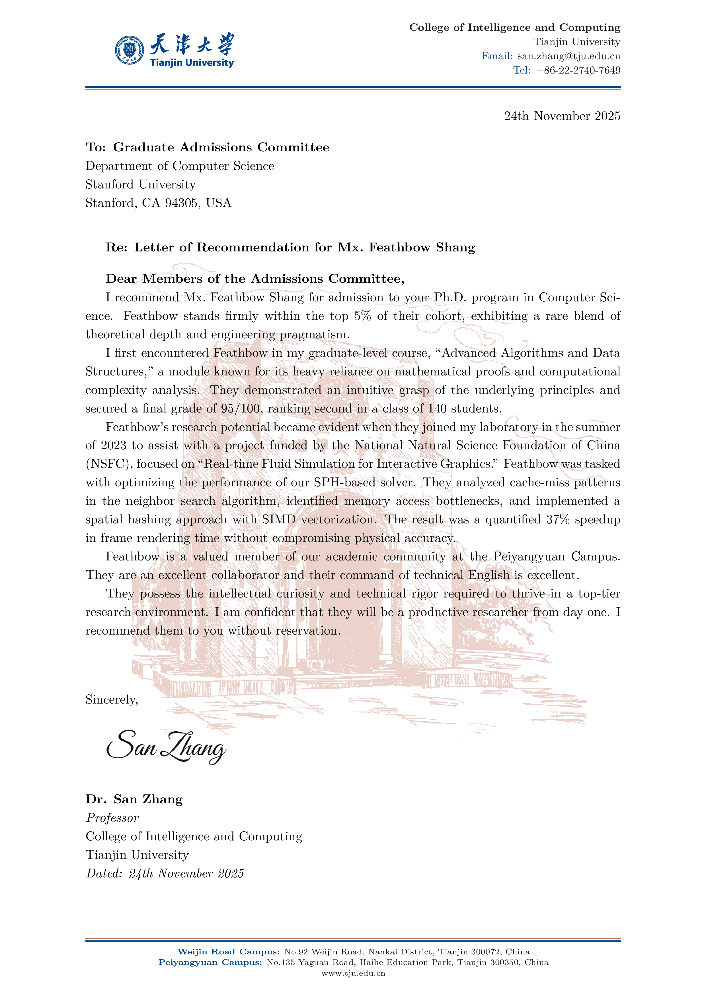

<div align="center">

# 天津大学推荐信 LaTeX 模板

<p>
  <a href="LICENSE"></a>
  <a href="https://www.latex-project.org/"></a>
  
  <a href="https://www.overleaf.com"></a>
  
  
  
</p>

<p>
  <a href="https://github.com/FeathBow/TJU-RL-template/stargazers"></a>
  <a href="https://github.com/FeathBow/TJU-RL-template/network/members"></a>
  <a href="https://github.com/FeathBow/TJU-RL-template/actions"></a>
</p>

**简体中文** | [English](README.md)

天津大学学术推荐信 LaTeX 模板

</div>

> [!IMPORTANT]
> 本项目**不是**天津大学官方模板。这是一个社区维护的项目，供师生使用。

---

## 目录

- [简介](#简介)
- [效果预览](#效果预览)
- [快速开始](#快速开始)
- [校区地址](#校区地址)
- [自定义设置](#自定义设置)
- [开发](#开发)
- [项目结构](#项目结构)
- [贡献](#贡献)
- [致谢](#致谢)
- [免责声明](#免责声明)
- [许可证](#许可证)
- [支持项目](#支持项目)

---

## 简介

天津大学学术推荐信 LaTeX 模板。本模板提供天大专属的信头元素（官方徽标、品牌配色、校区地址），并遵循国际学术格式规范（APA/AMA）。

天津大学前身为北洋大学，创建于 1895 年，是中国第一所现代大学。

---

## 效果预览



*[📄 下载PDF示例](main.pdf)*

---

## 快速开始

### 方式一：本地编译

**系统要求：**
- **TeX Live** 2020+ (XeLaTeX 编译器)

**字体说明：**
- 默认使用 **Computer Modern**（Latin Modern）- STEM 学科的学术标准字体
- 如需切换为 Times New Roman，请取消注释 `TJUletter.cls` 中的字体设置

**步骤：**

1. **克隆仓库**
   ```bash
   git clone https://github.com/FeathBow/TJU-RL-template.git
   cd TJU-RL-template
   ```

2. **准备素材** (放在 `assets/` 文件夹)
   - `logo.pdf` - 天大官方徽标
   - `signature.png` - 电子签名（可选）
   - `building.png` - 背景水印（可选）

3. **编辑 `main.tex`** 自定义发件人信息

4. **编译**
   ```bash
   xelatex main.tex
   # 或
   latexmk
   ```

### 方式二：在 Overleaf 使用

**方法1：上传 ZIP**（推荐）
1. 下载 [ZIP 压缩包](https://github.com/FeathBow/TJU-RL-template/archive/refs/heads/main.zip)
2. 访问 [Overleaf](https://www.overleaf.com) → **New Project** → **Upload Project**
3. 上传 ZIP 文件，开始编辑

**方法2：从 GitHub 导入**
1. Fork 本仓库到您的 GitHub 账户
2. 在 Overleaf 中：**New Project** → **Import from GitHub**
3. 选择您 Fork 的仓库

---

## 校区地址

<div align="center">

| 校区 | 地址 |
|:----:|:----:|
| **北洋园校区**<br>(New Campus) | No. 135 Yaguan Road, Haihe Education Park<br>Tianjin 300350, China |
| **卫津路校区**<br>(Old Campus) | No. 92 Weijin Road, Nankai District<br>Tianjin 300072, China |

</div>

---

## 自定义设置

| 功能 | 配置说明 | 文件位置 |
|------|---------|---------|
| **字体** | 默认：Computer Modern<br>切换 Times New Roman：取消注释字体设置 | `TJUletter.cls` |
| **背景图** | 默认：启用（`building.png`）<br>禁用：注释 `\makeWatermark` | `main.tex` |
| **电子签名** | 可选：添加 `signature.png` 到 assets 文件夹<br>通过 `\signaturefile{assets/signature.png}` 指定 | `main.tex` |
| **纸张尺寸** | 默认：A4<br>切换 US Letter：修改文档类为 `letterpaper` | `TJUletter.cls` |
| **页边距** | 上：3.175cm，下/左/右：2.54cm（APA/AMA 标准） | `TJUletter.cls` |
| **校区地址** | 双校区页脚（卫津路 + 北洋园） | `TJUletter.cls` |

---

## 开发

<details>
<summary><b>本地 Git Hooks（可选）</b></summary>

安装 pre-commit hooks 在提交前自动检查 LaTeX 文件：

```bash
# 安装 pre-commit 框架
pip install pre-commit

# 安装 hooks
pre-commit install

# 手动运行检查所有文件
pre-commit run --all-files
```

</details>

---

## 项目结构

```
TJU-RL-template/
├── .github/
│   ├── CONTRIBUTING.md           # 贡献指南
│   └── workflows/
│       └── latex-ci.yml          # GitHub Actions CI/CD
├── assets/
│   ├── logo.pdf                  # 天大官方徽标
│   ├── signature.png             # 电子签名（可选）
│   ├── building.png              # 背景水印
│   └── preview.png               # 模板预览图
├── .chktexrc                     # chktex 检查器配置
├── .gitattributes                # Git 语言识别
├── .gitignore                    # Git 忽略规则
├── .latexindent.yaml             # LaTeX 格式化配置
├── .latexmkrc                    # latexmk 构建配置
├── .pre-commit-config.yaml       # Pre-commit hooks 配置
├── LICENSE                       # MIT 开源协议
├── main.pdf                      # 编译示例 PDF
├── main.tex                      # 主模板文件（编辑此文件）
├── README.md                     # 英文文档
├── README.zh-CN.md               # 中文文档（本文件）
└── TJUletter.cls                 # LaTeX 文档类
```

---

## 贡献

欢迎贡献！您可以：
- 通过 [Issues](https://github.com/FeathBow/TJU-RL-template/issues) 报告问题
- 通过 Pull Request 提交改进
- 提出功能建议

详见 [CONTRIBUTING.md](.github/CONTRIBUTING.md)。没有严格的规则 - 保持简单和有用即可。

---

## 致谢

- **[TJU-VIS](https://github.com/tjuse/tju-vis)** - 为更便捷、规范地使用天津大学校徽、校标，该项目在天津大学视觉形象识别手册的基础上，进行了图形、文字的校正工作，并整理了完整的使用版本。
- **[gitignore.io](https://github.com/toptal/gitignore)** - 提供 .gitignore 模板生成服务。
- LaTeX 社区

---

## 免责声明

1. 本模板**仅供天大师生正当学术用途**使用。
2. 发送前务必**核对所有信息**。

---

## 许可证

[MIT License](LICENSE) - 可自由使用和修改。

---

## 支持项目

如果这个项目对您或您的学生有帮助，欢迎给项目一个 star。这有助于更多人发现这个模板，也鼓励我们继续维护。

<div align="center">

[](https://star-history.com/#FeathBow/TJU-RL-template&Date)

</div>

---

**为天大师生打造**

*天津大学前身为北洋大学，创建于 1895 年，是中国第一所现代大学。*
